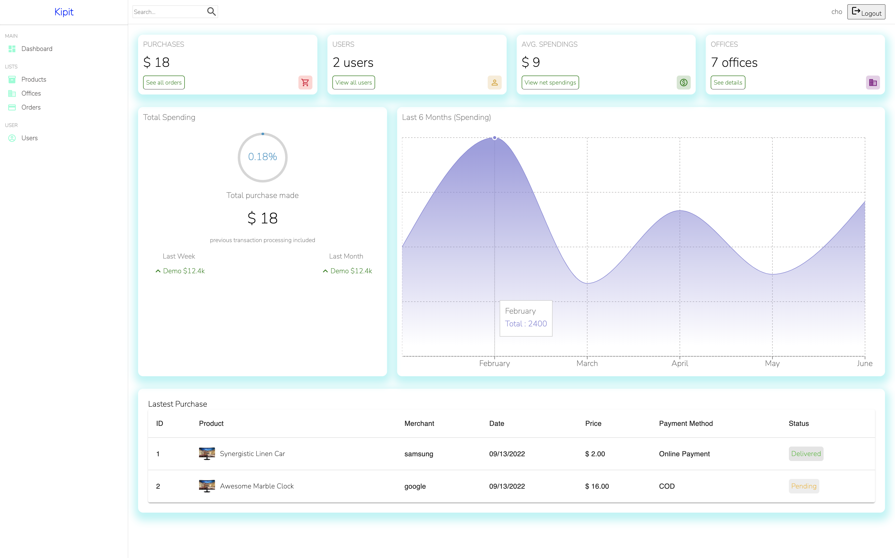

# Kipit

> Inventory system service to solve all companies’s headache of keeping track of company assets and inventories

## Table of contents

- [General info](#general-info)
- [Project Demo](#project-demo)
- [Project Video](#project-video)
- [Technologies](#technologies)
- [Setup](#setup)
- [Features](#features)
- [Inspiration](#inspiration)
- [Contact](#contact)
- [License](#license)

## General info

Cravin - Social meeting application that allows a user to chat and meet an anonymous user that has similar or opposite interests through users' answers to a shared question - for friends, relationship, help and all desires with only good intentions.

<div align="center">Welcome to Kipit. </div>
<br/>
<div align="center">
<kbd>

</kbd>
</div>

## Project Video

[Click to view demo of Cravin](https://youtu.be/Nwt6tZzo78Q)

## Technologies

### Backend Development

- Ruby 2.7.4
- Rails 7.0.3
- Active_model_serializers 0.10.12
- Bcrypt 3.1.7
- postgresql 9.3

### Frontend Development

- JavaScript (ES6)
- HTML5
- CSS3
- React.js - version 18.2.0
- React-DOM - version 18.2.0
- React-Router-DOM - version 6.3.0
- React-Tinder-Card - version 1.4.5
- Moment-timezone - version 0.5.34
- Emotion/react - version 11.9.3
- Emotion/styled - version 11.9.3
- React-Scripts - version 5.0.1
- Sass - version 1.53.0
- React-bootstrap - version 2.4.0
- Material-UI - version 5.8.4
- Materialize-Icons - version 5.8.4
- Materiali-UI/x-data-grrid - version 5.12.2
- ReaCharts - version 0.4.5
- Recharts - version 2.1.10

## Setup

To try out this project:

1. Clone the GitHub repository locally to your computer
1. In the command line, navigate to the root directory of the repository, and type the following:
   $ bundle install
1. Navigate to the client folder, and in the root directory of the client folder, type the following:
   $ npm install
1. In the client folder, and in the root directory of the client folder, type the following:
   $ npm start
1. Navigate back to the root directory of this project "inventory-system" and start the server by typing the following:
   $ rails server

## Code Examples

### Ruby on Rails

```Ruby on Rails
class ApplicationController < ActionController::API
  include ActionController::Cookies

  rescue_from ActiveRecord::RecordInvalid, with: :render_unprocessable_entity_response

  before_action :authorize

  private

  def authorize
    @current_user = User.find_by(id: session[:user_id])

    render json: { errors: ["Not authorized"] }, status: :unauthorized unless @current_user
  end

  def render_unprocessable_entity_response(exception)
    render json: { errors: exception.record.errors.full_messages }, status: :unprocessable_entity
  end

end
```

### JavaScript/React.js

```React.js
function handleDelete(id) {
    fetch(`/products/${id}`, {
      method: "DELETE",
    }).then((r) => {
      if (r.ok) {
        setProducts(products.filter((item) => item.id !== id));
      }
    });
  }
```

## Features

- Full stack web application utilizing React and Ruby on Rails.
- Authorization and authenication implemented Rails Bcrypt.
- Front-End styles and components built with Material UI.
- Users can create account through application.
- User can add products in the inventory system
- User can edit details of the product such as price, quantity and location
- User can delete the products
  \_ User can check the status of the inventory in dashboard

## Status

Project is: finished with option to expand functionality and DRY out code.

## Inspiration

The inspiration for Kipit comes from my personal struggles when I managed the entire inventories of the hotel with old school excel sheets. Even though we had a well knwon Property Management System with inventory function included, nobody was bothered to use it because it was too outdated and not user friendly at all. I wanted to develop an inventory system that is easy and simple to use for all users who would like to keep track of not only office supplies and company assets but also personal belongings at home.

## Contact

Created by [Hyun Sung Cho](https://www.linkedin.com/in/chothechallengebreaker/)
Feel free to contact me for any questions!

## License

[Click to view]()
